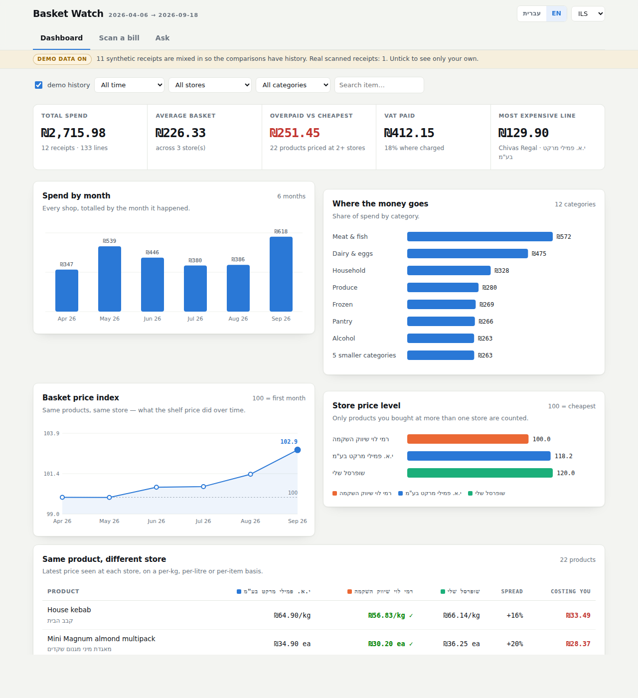

# Basket Watch — scan bills, get a spending dashboard

Photograph a receipt, hand it to Claude, get it back as structured data plus a
dashboard that compares prices across stores and over time.



The app has three screens and speaks Hebrew and English:

| Screen | What it is for |
|---|---|
| **Dashboard** | Spending, price trends, store comparison |
| **Scan a bill** | Drop a receipt photo into the page; Claude reads it and saves it |
| **Ask** | Questions in plain language, answered from your receipts |

## How it works

Two ways in, one data store:

```
photo of a bill ─┬─► bill-scanner skill (Claude Code) ─┐
                 │                                     ├─► receipt JSON ──► dashboard
                 └─► Scan screen (published app) ──────┘
```

In the repo the receipts are JSON files under `data/receipts/` and the dashboard is a
single self-contained HTML file. In the published app, receipts scanned on the Scan
screen are stored with the artifact and merge into the same views.

## Hebrew and English

The language switch in the header changes the interface language, the text direction
(the whole layout mirrors for Hebrew), date and number formatting, and the category
names. Item names are always shown as printed on the receipt, with the translation
underneath. Time charts keep running left-to-right in both languages; the category and
store bars mirror.

The currency selector formats amounts in ILS, USD, EUR or GBP. Receipts record shekels,
so another currency needs an exchange rate — type one in the box next to the selector
and amounts convert for display only. Without a rate the app keeps showing shekels
rather than inventing one.

## Scanning a bill

**In the app**: open the *Scan* tab, photograph the receipt, and Claude reads it on the
spot. You get the parsed lines, a check that they sum to the printed total, and a Save
button. There are two routes to Claude and the app picks whichever is available:

| Where | Route | Who pays |
|---|---|---|
| Published artifact | the artifact's own Claude runtime | whoever opens it, from their Claude account |
| Android app, or any browser | an Anthropic API key you paste into Settings | your API account, about $0.09 a scan |

The key is stored only on that device and is never packaged with the app — anyone else
installing it needs their own. In the Android app the request is made from Java rather
than from the page, because a `file://` WebView has no origin the API will accept.

**In Claude Code (or Cowork)**: drop the photo into the chat and say:

> scan this bill

The `bill-scanner` skill in `.claude/skills/bill-scanner/` takes over: it transcribes
every line as printed, writes `data/receipts/<date>_<store>_<doc>.json`, and rebuilds the
dashboard. It knows Hebrew receipts — right-to-left rows, `ק"ג` weighed lines, the
`מע"מ` block — and flags anything it could not read rather than guessing.

There is also a `bill-scanner` subagent (`.claude/agents/bill-scanner.md`) if you would
rather hand a stack of photos to a background agent.

## Looking at the dashboard

```bash
python3 scripts/build_dashboard.py     # validate every receipt, rebuild the page
python3 scripts/serve.py               # http://localhost:8000/dashboard/index.html
```

Or just open `dashboard/index.html` in a browser — it has no dependencies.

What it shows:

| Panel | Question it answers |
|---|---|
| Total spend / average basket | What am I actually spending? |
| **Overpaid vs cheapest** | What did this shopping cost me versus buying each item at the cheapest store I have seen? |
| Spend by month | Is it going up? |
| Where the money goes | Which categories eat the budget? |
| **Basket price index** | Same products, same store — what did the shelf price do? (100 = first month) |
| **Store price level** | Which store is cheapest on the things I actually buy? (100 = cheapest) |
| Same product, different store | Per-kg / per-litre price at each store, cheapest marked |
| Price movers | Biggest price rises and drops, same product, same store |
| Every line item | Sortable, searchable; amber rows need a check against the paper |

## Asking questions

The *Ask* screen answers questions about your own receipts — "which store is cheapest
for me?", "what went up the most?", "how much did I spend on meat last month?". It
answers in whichever language the app is set to.

It is given a summary of the data plus a `query_lines` tool it can call to filter the
line items itself, so numbers come from your receipts rather than from a guess. It runs
on the viewer's Claude account and only in the published app.

Comparisons are like-for-like on purpose: prices are normalised to **per kg, per litre or
per item** before anything is compared, and price trends only ever compare a product with
itself **at the same store** — otherwise a cheaper supermarket entering the data would
read as deflation.

## Layout

```
.claude/skills/bill-scanner/   how Claude reads a bill (scanning rules, Hebrew glossary)
.claude/agents/bill-scanner.md the subagent version
schema/receipt.schema.json     the receipt contract
data/receipts/                 your receipts, one JSON per bill
data/images/                   the original photos
scripts/receipts.py            load, validate, normalise
scripts/build_dashboard.py     validate + render the dashboard
dashboard/template.html        the page source (edit this)
dashboard/index.html           generated — do not edit by hand
```

## Android app

`android/` wraps the generated dashboard in a WebView. Download the built APK at
**https://github.com/samsambm/webapi/releases/download/apk-latest/basket-watch.apk**
— that link is public, needs no login and is rebuilt on every push. To build it
yourself, run `android\build-apk.bat` (Windows) or `android/build-apk.sh`. See
`android/README.md`.

Scanning and Ask work in the APK once you add an Anthropic API key under Settings on the
Scan tab. The receipt data compiled into the APK is a build-time snapshot; anything you
scan on the phone is stored on the phone.

## Running this as a product

Worth knowing before this goes to real customers, because it changes who pays for
the AI:

- **Today the AI is free to you.** In the published artifact, Scan and Ask run on
  *each viewer's own Claude account*. That only works for people signed in to
  claude.ai who have been given the artifact, so it is fine for you and a few
  colleagues and is not a distribution channel.
- **With customers, you pay per call**, through your own Anthropic API key, and you
  need a backend to hold it. Never put an API key in an APK — it can be extracted
  from the package in minutes. The shape is: phone → your server (key, per-user
  quota, logging) → Anthropic API.
- **Rough cost per receipt scanned** (≈2.5K input tokens for the photo and prompt,
  ≈3K output tokens for the JSON): about $0.09 on Claude Opus 5, $0.035 on Sonnet 5,
  $0.015 on Haiku 4.5. At 1,000 customers scanning 4 receipts a month that is
  roughly $350 / $140 / $60 a month. Verify with `count_tokens` and real
  `response.usage` before pricing anything on it.
- **Levers**: the Batch API halves the cost for scans that can wait; prompt caching
  cuts the repeated context on the Ask screen; and a smaller model for scanning is
  worth measuring against a set of real receipts before assuming it is worse.

## Validation

`build_dashboard.py` refuses to write the dashboard if a receipt is broken. It checks the
JSON against `schema/receipt.schema.json` (when `jsonschema` is installed), that every line
satisfies `quantity × unit_price = total`, that the lines sum to the printed total, that
`taxable + VAT + exempt = total`, and that no two receipts share an id.

```bash
python3 scripts/build_dashboard.py --check     # validate only
```

Only the last 4 digits of a card are ever stored. EMV fields (UID, RRN, AID) are discarded.
